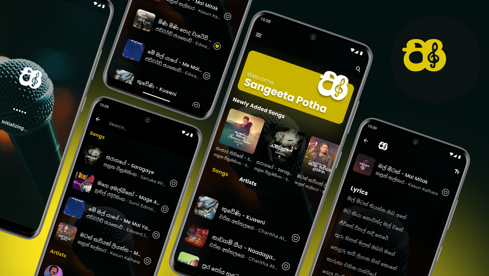

# Sangeetha Potha App

A song lyrics library application built with Flutter and Firebase.



## 📱 Features

- Song lyrics library
- Artist categorization
- Favorite song lyrics collection
- Offline data persistence with SQLite
- Real-time data synchronization with Firebase
- Favorites management using Shared Preferences

## 🛠️ Tech Stack

### Frontend
- Flutter
- Provider (State Management)
- Material Design 3

### Backend & Services
- Cloud Firestore (for lyrics storage and real-time sync)
- Firebase Storage

### Local Storage
- SQLite (using `sqflite` package for offline lyrics storage)
- Shared Preferences (for managing favorite songs)

### Development Tools
- Dart SDK
- Flutter SDK
- Visual Studio Code

## 🚀 Getting Started

### Prerequisites
- Flutter SDK (3.x or higher)
- Dart SDK (3.x or higher)

### Installation

1. Clone the repository
```bash
git clone https://github.com/yourusername/sangeetha_potha_app_flutter.git
cd sangeetha_potha_app_flutter
```

2. Install dependencies
```bash
flutter pub get
```

3. Set up environment variables
- Create a `.env` file in the project root
- Copy contents from `.env.example`
- Fill in your Firebase configuration values

4. Run the app
```bash
flutter run
```

## Firebase Setup

1. Install FlutterFire CLI
```bash
dart pub global activate flutterfire_cli
```

2. Configure Firebase for your app
```bash
flutterfire configure
```

This will:
- Create necessary Firebase config files
- Set up platform-specific configurations
- Generate Firebase options

## 🔒 Environment Variables

Required environment variables in your `.env` file:

```plaintext
FIREBASE_WEB_API_KEY=
FIREBASE_WEB_APP_ID=
FIREBASE_WEB_MESSAGING_SENDER_ID=
FIREBASE_WEB_PROJECT_ID=
FIREBASE_WEB_AUTH_DOMAIN=
FIREBASE_WEB_STORAGE_BUCKET=

FIREBASE_ANDROID_API_KEY=
FIREBASE_ANDROID_APP_ID=

FIREBASE_IOS_API_KEY=
FIREBASE_IOS_APP_ID=
FIREBASE_IOS_BUNDLE_ID=

FIREBASE_WINDOWS_API_KEY=
FIREBASE_WINDOWS_APP_ID=
```

**Note:**  
The app retrieves lyrics from Firebase Cloud Firestore and stores them locally using SQLite via the `sqflite` package for offline access. Real-time synchronization ensures your local database stays updated with Firebase. Favorite songs are managed using Shared Preferences for quick access and persistence.
